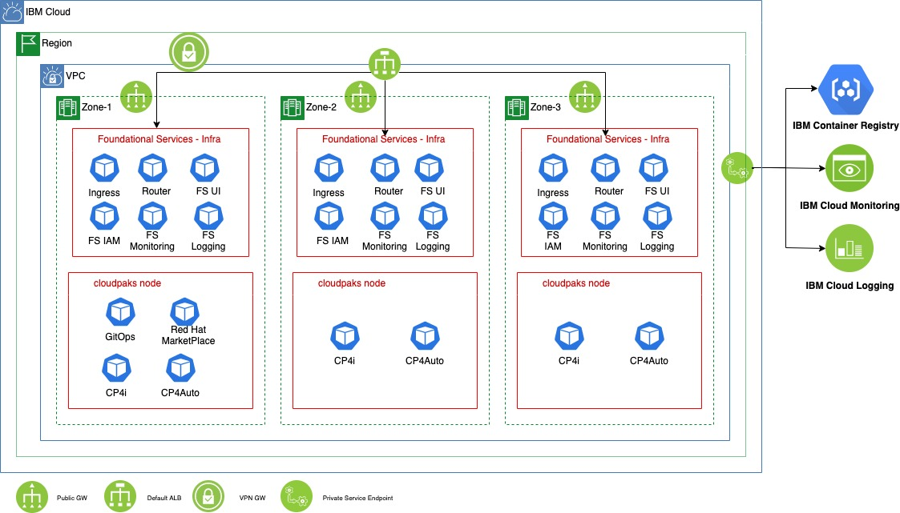
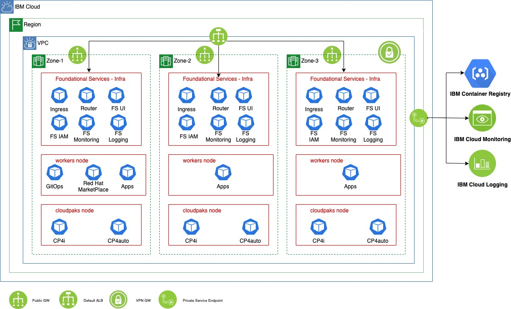
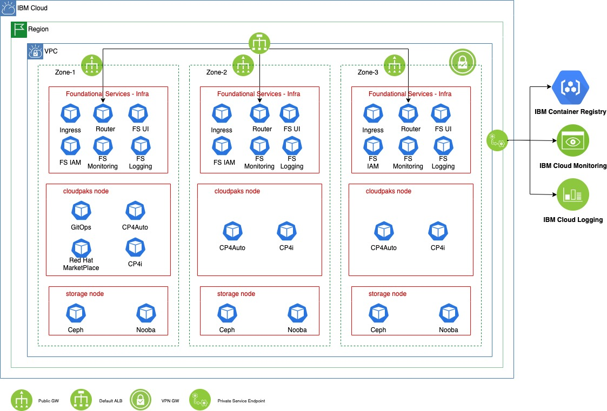
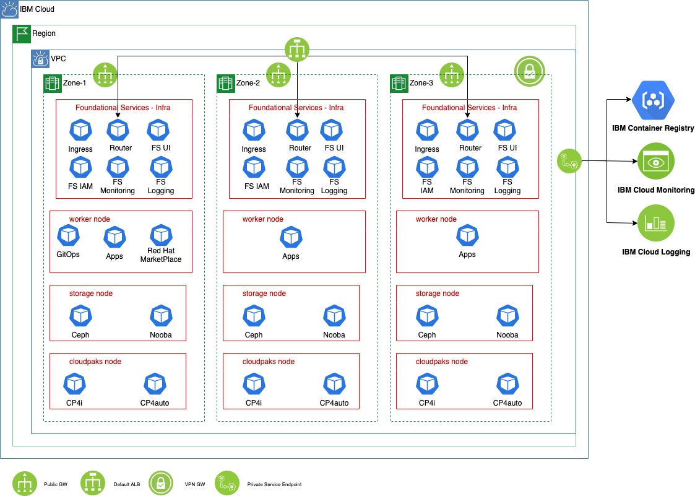

# ROKS Production Deployment Guide
There are 4 proposed topologies depending on the deployment requirements, choose the one that adapts better to your needs. All topologies deploy Foundational Services as the Cloud Paks requires them to run, and some OpenShift infrastructure elements are deployed over these nodes.  

## ROKS-split-1:
    - Foundational Services
    - Cloud Paks

## ROKS-split-2:
    - Foundational Services
    - Cloud Paks
    - Workers (for non Cloud Paks workloads)

## ROKS-split-3:
    - Foundational Services 
    - Cloud Paks
    - Storage (Openshift Data Foundation using IBM Cloud CRDs)

## ROKS-split-4:
    - Foundational Services
    - Cloud Paks
    - Storage (Openshift Data Foundation using IBM Cloud CRDs)
    - Workers (for non Cloud Paks workloads)

This guide divides in 4 parts:

- [Set up the VPC in IBM Cloud](./deploy-vpc.mdx)
- [Create the VPN gateway to secure connect to te VPC](./deploy-vpn-gateway.mdx)
- [Deploy the cluster. 4 Topologies recommended](./deploy-roks.mdx)
- [Deploy the GitOps strategy](./deploy-gitops.mdx)